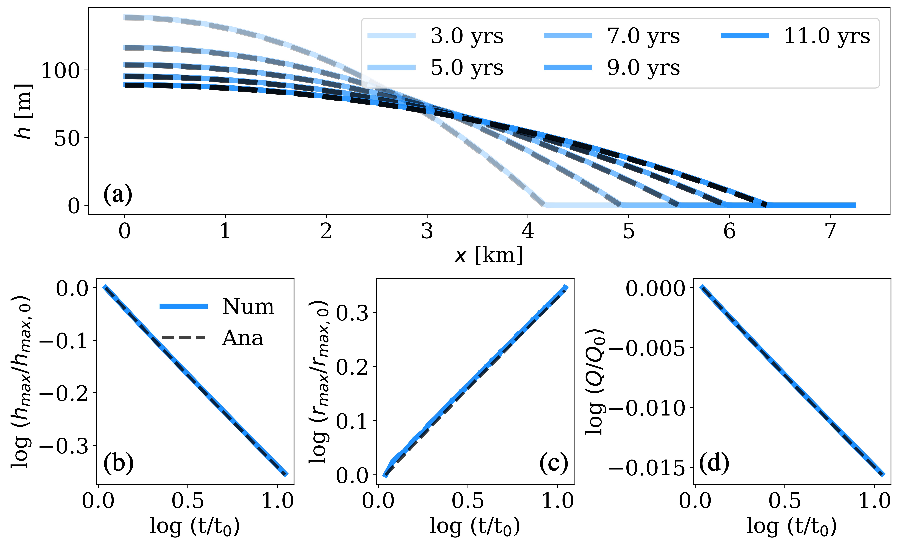

# ColdFirnAquifer3D : A Vertically Integrated Model with Phase Change for Aquifers in Cold Firn

## Overview

This project develops a **vertically integrated model** that captures the coupled **phase change and flow dynamics** governing meltwater migration in **cold firn**, the sintered and compacted snow on glaciers and ice sheets.

The model bridges the physics of **gravity-driven saturated flow in soils** with **meltwater percolation and refreezing in firn**, offering a unified theoretical framework for hydrologic processes across temperate and polar environments. Unlike traditional approaches, this model explicitly includes **latent heat effects**, **porosity evolution**, and **residual liquid trapping**.

---

## Authors
- **Mohammad Afzal Shadab**1,2 ⭐ (mashadab@princeton.edu)  
- **Howard A. Stone**3  
- **Reed M. Maxwell**1,2,4  

⭐ = corresponding author  

---

## Affiliations
1. Department of Civil and Environmental Engineering, Princeton University, Princeton, NJ 08544, USA  
2. Integrated Groundwater Modeling Center, Princeton University, Princeton, NJ 08544, USA  
3. Department of Mechanical and Aerospace Engineering, Princeton University, Princeton, NJ 08544, USA  
4. High Meadows Environmental Institute, Princeton University, Princeton, NJ 08544, USA  

---

## Citation
If you use this code or data, please cite:  
**Shadab, M.A., Stone, H.A., and Maxwell, R.M. (202X).** *A vertically integrated model with phase change for aquifers in cold firn* (under review).

---

## Getting Started
### Dependences

The codes require the following packages to function:
- [Python](https://www.python.org/) version 3.5+
- [Numpy](http://www.numpy.org/) >= 1.16
- [scipy](https://www.scipy.org/) >=1.5
- [matplotlib](https://matplotlib.org/) >=3.3.4

Tested on
- [Python](https://www.python.org/) version 3.9.14
- [Numpy](http://www.numpy.org/) version 1.25.2
- [scipy](https://www.scipy.org/) version 1.11.2
- [matplotlib](https://matplotlib.org/) version 3.7.2

### Quick Usage
After cloning the repository and installing the required Python libraries, the main scripts can be executed directly in the `\src\Figure.py`
All figures will be saved automatically in the `\Figures` directory.

---

## Model Description

The model solves a **vertically integrated flow equation with latent heat coupling**, allowing for:
- Phase change between liquid water and ice  
- Porosity evolution and residual water trapping  
- Analytical and numerical comparisons  
- Expansion of firn aquifers in cold, heterogeneous conditions  

The code includes benchmark cases and plotting routines to reproduce figures from the manuscript.

---

## Example Results

### Expansion of aquifer in cold firn: Analytical (Ana) vs Numerical (Num) Solutions

Expansion of an aquifer in a uniform, cold firn outside the aquifer with initial temperature and 70% porosity. (a) Numerical (Num) and analytical (Ana) solutions to the dimensional aquifer height at different times. Evolution of dimensionless (b) maximum height, (c) maximum length, and (d) volume of liquid water in the aquifer, scaled with respect their initial values at time (subscript 0 refers to the initial values). Analytical solutions agree with the numerical solution of the vertically integrated model.

### 3D Aquifer Expansion in Cold Firn (left to right) : Aquifer height h (in m)
https://github.com/user-attachments/assets/b0f84a4b-1fa5-4a86-aa00-97052de8d908

### 3D Aquifer Expansion in Temperate Firn (left to right) 
https://github.com/user-attachments/assets/e8ee956f-38aa-4aa7-9b67-17adc90ec2da

---
